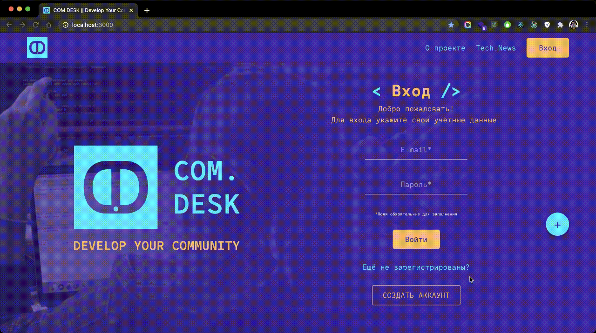
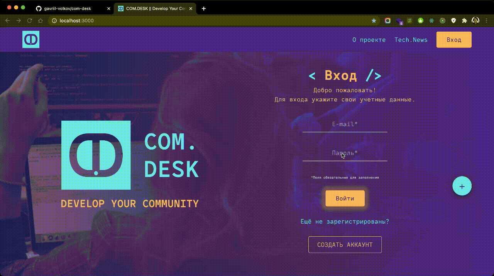
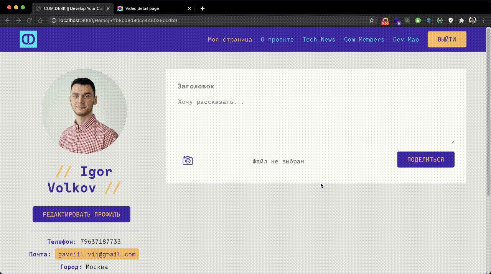
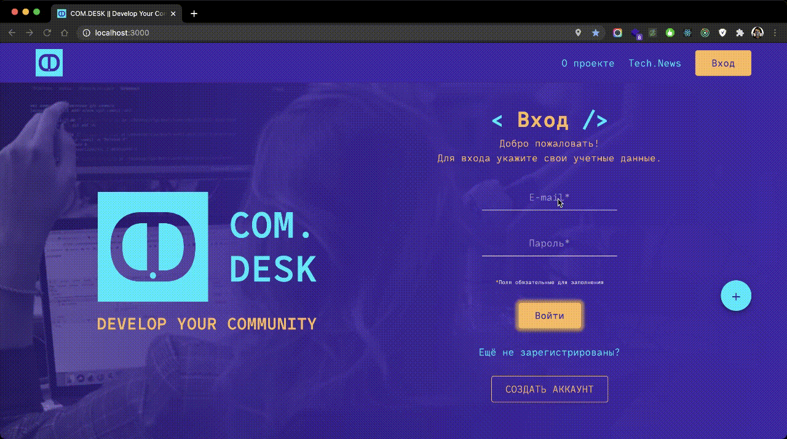

# FullStack Корпоративный портал COM.DESK 

## Приложение COM.DESK поможет вам оставаться на связи и следить за успехами своих коллег внутри закрытого комьюнити

## Стэк - React, Redux, Express, MongoDB

### Видео презентация проекта: https://youtu.be/ZWpFWjCn5I8

### Команда разработчиков:
- [Александра М.](https://github.com/AleksandraMakhmutova)
- [Александер П.](https://github.com/PapakhinAV)
- [Салман О.](https://github.com/SalmanOsmanov)
- [Игорь В.](https://github.com/gavriil-volkov)

### Приложение возможно использовать как: 

- решение Digital Signage для сенсорного киоска
- интранет внутри локальной сети
- социальная сеть
- закрытый портал
- блог

## Для запуска проекта

- Склонировать проект
- Инициализировать проект в корневой папке - yarn
- В папке backend инициализировать проект - npm i
- В корневой папке создать файл .env (Смотреть внизу README)
- В папке backend создать файл .env 
- Запустить проект из папки backend - npm start
- Для запуска приложения используется база MongoDB в Atlas
- Приложение запустится после билда (дождаться окончания) по адресу localhost:3000

#
## Возможности приложения

### `Регистрация юзера`

Каждый юзер может зарегистрироваться указав свои данные.

#
### `Авторизация через социальные сети (Passport.JS)`

- GitHub - Автоматически подтягивается имя пользователи и аккаунт GitHub в профиль юзера
- Google - Автоматически подтягивается имя пользователи Google в профиль юзера

*Есть возможность добавить дополнительные сети для авторизации и подтягивать любую открытую информацию в профиль юзера

#
### `Редактирование профиля юзера`

- Добавление/удаление фото
- Добавление/удаление группы
- Редактрирование контактных данных
- Редактирование социальных сетей

#
### `Добавление/удаление постов на странице юзера`

Каждый юзер может добавлять на своей страницы информационные посты. Пост может удалить только юзер разместивший его.

#
### `Парсер тех.новостей (3D News)`

Парсер подтягивает 15 свежих и актуальных тех. новостей с сайта 3D News.

#
### `Группы`

Есть возможность распределять юзеров по группам. Выбрать группу или выйти из нее можно в разделе "Редактировать профиль". В группе можно посмотреть всех юзеров которые вступили в нее. На странице юзера нельзя удалить его личные посты и редактировать его данные.

#
### `Отметка юзера на карте по ip (Яндекс API)`

Каждый юзер может отметить себя на карте. Отметка производится по текущему ip адресу.

#
### `Администратор`

Администратор может удалять юзеров, создавать/редактировать/удалять группы.

Login: admin@mail.ru

Password: aaaa

#
## Файл .env (Корневая папка):

SKIP_PREFLIGHT_CHECK=true

REACT_APP_URL=http://localhost:3000

#
## Файл .env (Папка backend):

PORT=3000

MONGO_DB='ЗАПРОСИТЬ У АВТОРА'

HOST:http://localhost:3001

SECRET:'ЗАПРОСИТЬ У АВТОРА'

GITHUB_CLIENT_ID = ЗАПРОСИТЬ У АВТОРА

GITHUB_CLIENT_SECRET = ЗАПРОСИТЬ У АВТОРА

GITHUB_CALLBACK_URL = /auth/github/callback

GOOGLE_CLIENT_ID = ЗАПРОСИТЬ У АВТОРА

GOOGLE_CLIENT_SECRET = ЗАПРОСИТЬ У АВТОРА

GOOGLE_CALLBACK_URL = /auth/google/callback
